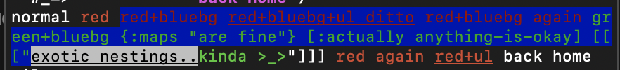

```clojure
(str "normal"
           (red "red"
                  (bg-blue "red+bluebg"
                             (underline "red+bluebg+ul" "ditto")
                             "red+bluebg again"
                             (green "green+bluebg"
                                      {:maps "are fine"}
                                      [:actually 'anything-is-okay]
                                      (let [invert-override (comp black bg-white)]
                                        [[[(p-str (underline (invert-override "exotic nestings.."))
                                                  (green "kinda >_>"))]]])))
                  "red again"
                  (underline "red+ul"))
            "back home")
```




